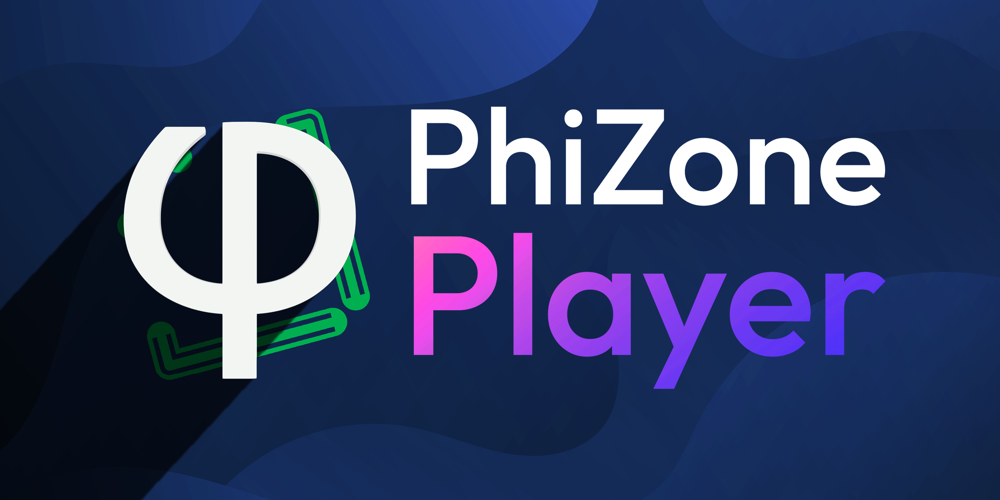

# PhiZone Player



PhiZone Player is an HTML5 Phigros chart player/simulator based on Phaser.

### Frameworks

This project is made possible by:

- [Phaser](https://github.com/phaserjs/phaser)
- [Svelte](https://github.com/sveltejs/kit)
- [Vite](https://github.com/vitejs/vite)
- [TypeScript](https://github.com/microsoft/TypeScript)

## Introduction

Much of this program resembles any other Phigros chart player/simulator, so this section will focus solely on its unique features.

### User-friendly landing page

Designed with [Preline UI](https://preline.co/) and [daisyUI](https://daisyui.com/), the landing page is meticulously written to be as intuitive yet powerful as possible.

Choose either some files (or .zip/.pez archives) or an entire folder, and chart bundles will be automatically detected according to Re: PhiEdit (or RPE) metadata files (typically named `info.txt`) in which a chart, a song, and an illustration are specified. Any other files that fail to be recognized, which are most likely multimedia that will be referenced by the chart, or the `extra.json` from Phira, will be presented in the assets.

On desktop platforms, you can open .zip/.pez archives directly with the PhiZone Player app.

On mobile platforms, you can share chart archives to the app so that it can receive and resolve them.

Additionally, the program can automatically download files from URLs specified in the `zip` and `file` search parameters. A `zip` parameter should be provided a URL to a zip archive, while a `file` parameter should be provided a URL to a regular file.

### Innovative keyboard controls

Similar to a video player, the program includes handy keyboard controls that are available in autoplay/practice mode:

- Pause/Resume: Press <kbd>Space</kbd> to toggle. (In practice mode, press <kbd>⇧ Shift</kbd>+<kbd>Space</kbd> to pause.)
- Rewind/Forward: Use <kbd>←</kbd> / <kbd>→</kbd> to jump 5 seconds, or <kbd>⇧ Shift</kbd>+<kbd>←</kbd> / <kbd>⇧ Shift</kbd>+<kbd>→</kbd> for precise 0.1-second adjustments.

Besides, <kbd>ESC</kbd> is always available to pause with/resume from the pause screen, and you can use alphanumeric and punctuation keys on your keyboard to hit the notes when autoplay is off.

### APNG support

Animated PNGs are an excellent alternative to GIFs, offering enhanced color fidelity and the support of an 8-bit alpha channel for smoother transparency effects.

An APNG acts exactly the same way as a GIF does, unless the number of repetitions is specified in the file, according to the APNG specification.

### Z indexes

The Z index (depth) defines the order in which game objects are rendered. The lower the value, the earlier they are rendered.

| Default Z index (depth) | Object(s)                                                                  |
| ----------------------- | -------------------------------------------------------------------------- |
| 0                       | Illustration                                                               |
| 1                       | Background video, if present                                               |
| [2, 3)                  | Judgment lines, the order of which are determined by their `zOrder` values |
| 3                       | Hold notes                                                                 |
| 4                       | Drag notes                                                                 |
| 5                       | Tap notes                                                                  |
| 6                       | Flick notes                                                                |
| 7                       | Hit effects                                                                |
| 8                       | Pause button                                                               |
| 9                       | Combo counter                                                              |
| 10                      | Text beneath the combo counter                                             |
| 11                      | Score                                                                      |
| 12                      | Std deviation & accuracy                                                   |
| 13                      | Progress bar                                                               |
| 14                      | Song title                                                                 |
| 15                      | Level name & difficulty                                                    |

The Z indexes of judgment lines whose `zIndex` is not present (see [Chart enhancements](#chart-enhancements)) are calculated based on their `zOrder` values ([code here](https://github.com/PhiZone/player/blob/ed8a6119a28c8594d372aacb8e1da12fdce6d692/src/player/utils.ts#L595)). Simply put, the values are mapped onto [0, 1) and made equally spaced, and then get added by 2 to become Z indexes. See examples below.

| `zOrder`           | Z index               |
| ------------------ | --------------------- |
| 0, 10, 20, 30      | 2, 2.25, 2.5, 2.75    |
| 127, 0, 0, 1       | 2.6667, 2, 2, 2.3333  |
| 1, 2, 5, 6, 114514 | 2, 2.2, 2.4, 2.6, 2.8 |

### Chart enhancements

Aside from adding support for RPE features, we've also designed some original properties for judgment lines & notes.

| Property             | Value(s)                                            | Example                         | Description                                                                                                                                                                                                                                                                    |
| -------------------- | --------------------------------------------------- | ------------------------------- | ------------------------------------------------------------------------------------------------------------------------------------------------------------------------------------------------------------------------------------------------------------------------------ |
| `scaleOnNotes`       | `0`: none; `1`: scale; `2`: clip                    | `"scaleOnNotes": 2`             | Belongs to a judgment line. Decides how `scaleX` events affect notes. Defaults to `0`.                                                                                                                                                                                         |
| `appearanceOnAttach` | `0`: hidden; `1`: white colored; `2`: FC/AP colored | `"appearanceOnAttach": 2`       | Belongs to a judgment line. Decides how the line will be displayed when a UI component or any video is attached to it. Color events will override the color defined by these options. Defaults to `0`.                                                                         |
| `zIndex`             | an integer or a float                               | `"zIndex": 3.5`                 | Belongs to a judgment line or note. Sets the Z index for the object. For a judgment line, this property, if set, overrides the `zOrder` property, allowing for more control over on which layer the line should be displayed. For default values, see [Z indexes](#z-indexes). |
| `zIndexHitEffects`   | an integer or a float                               | `"zIndexHitEffects": 6.5`       | Belongs to a note. Sets the Z index for the hit effects of the note. Defaults to `7`.                                                                                                                                                                                          |
| `tint`               | [R, G, B], as seen in `colorEvents`; `null`         | `"tint": [255, 0, 0]`           | Belongs to a note. Sets the tint for the note. Defaults to `null`.                                                                                                                                                                                                             |
| `tintHitEffects`     | [R, G, B], as seen in `colorEvents`; `null`         | `"tintHitEffects": [255, 0, 0]` | Belongs to a note. Sets the tint for the hit effects of the note. Defaults to `null`.                                                                                                                                                                                          |
| `judgeSize`          | a positive number or 0                              | `"judgeSize": 1.5`              | Belongs to a note. Determines the width of the judgment area of the note. Defaults to `size`.                                                                                                                                                                                  |

### Video enhancements

Support for videos in `extra.json` gets extended with the following new properties for each entry in the `videos` list:

| Property | Type   | Description                                                                                 |
| -------- | ------ | ------------------------------------------------------------------------------------------- |
| `zIndex` | Number | Determines the Z index for this video. Defaults to `1`.                                     |
| `attach` | Object | Attaches this video to a judgment line, if this property is present. See below for details. |

Properties residing in the `attach` object:

| Property                     | Type   | Description                                                                                                                                       |
| ---------------------------- | ------ | ------------------------------------------------------------------------------------------------------------------------------------------------- |
| `line`                       | Number | Determines which line this video is attached to.                                                                                                  |
| `positionXFactor` (optional) | Number | Multiplied by the x position of the line, determines the x position of this video. Defaults to `1`.                                               |
| `positionYFactor` (optional) | Number | Multiplied by the y position of the line, determines the y position of this video. Defaults to `1`.                                               |
| `rotationFactor` (optional)  | Number | Multiplied by the rotation of the line, determines the rotation of this video. Defaults to `1`.                                                   |
| `alphaFactor` (optional)     | Number | Multiplied by the alpha of the line, determines the alpha of this video, together with the `alpha` property of the video itself. Defaults to `1`. |
| `tintFactor` (optional)      | Number | Multiplied by the tint of the line, determines the tint of this video. Defaults to `1`.                                                           |
| `scaleXMode` (optional)      | Number | Determines how `scaleX` events of the line affect this video. Values same as in `scaleOnNotes`. Defaults to `0`.                                  |
| `scaleYMode` (optional)      | Number | Determines how `scaleY` events of the line affect this video. Values same as in `scaleOnNotes`. Defaults to `0`.                                  |

### Shader enhancements

Except for WebGL's incompatibilities with newer versions of GLSL, the program supports not only all the shader features defined by `extra.json`, but also one original addition to the standard: **target range**.

A target range defines a list of depth-adjacent (next to each other on the Z axis) game objects that a shader event is applied to. It belongs directly to a shader event (as the optional `targetRange` property) and consists of the following properties:

| Property               | Type    | Description                                                                                                                                                                             |
| ---------------------- | ------- | --------------------------------------------------------------------------------------------------------------------------------------------------------------------------------------- |
| `minZIndex`            | Number  | Defines the minimum Z index (depth) of this range. Inclusive.                                                                                                                           |
| `maxZIndex`            | Number  | Defines the maximum Z index (depth) of this range. Exclusive.                                                                                                                           |
| `exclusive` (optional) | Boolean | Determines whether this range should exclude the range of another active shader event when the two ranges intersect but this range is not a superset of the other. Defaults to `false`. |

If the `global` property of a shader event is set to `true`, then its `targetRange` will not function.

One thing to note is that a single object cannot be rendered in parallel by two or more shaders. However, a set of targets from one shader event can be safely contained within the targets of another shader event. This leads to the concept of the `exclusive` property - it determines whether or not to "swallow" another set of objects when it intersects with but is not a subset of the current.

<details>
  <summary>Click to show an example of <code>extra.json</code> incorporating target ranges.</summary>

```jsonc
{
  // ...
  "effects": [
    {
      "start": [293, 0, 1],
      "end": [300, 0, 1],
      "shader": "/example.glsl",
      "global": false,
      "targetRange": {
        "minZIndex": 3,
        "maxZIndex": 4,
      }, // Hold notes
      "vars": {
        // ...
      },
    },
    {
      "start": [293, 0, 1],
      "end": [463, 0, 1],
      "shader": "/example.glsl",
      "global": false,
      "targetRange": {
        "minZIndex": 8,
        "maxZIndex": 16,
      }, // The entire UI
      "vars": {
        // ...
      },
    },
    {
      "start": [66, 0, 1],
      "end": [296, 0, 1],
      "shader": "/another-example.glsl",
      "global": true,
      // targetRange is optional
      "vars": {
        // ...
      },
    },
  ],
}
```

Notice that there are two events that share the same shader code. This is a workaround when you want to apply the same shader to objects that are not adjacent on the Z axis.

</details>

### Customizable resource pack

We have support for Phira resource packs (except for `hitFxScale`, `hitFxRotate`, `hitFxTinted`). Moreover, we've designed a new format to allow for more customizations:

- Root:

  | Property                 | Type                        | Description                                                                                                                                                                                                       |
  | ------------------------ | --------------------------- | ----------------------------------------------------------------------------------------------------------------------------------------------------------------------------------------------------------------- |
  | `name`                   | String                      | The name of the resource pack.                                                                                                                                                                                    |
  | `author`                 | String                      | The author of the resource pack.                                                                                                                                                                                  |
  | `description` (optional) | String                      | The description of the resource pack.                                                                                                                                                                             |
  | `thumbnail` (optional)   | String                      | The file name of the thumbnail image of the resource pack.                                                                                                                                                        |
  | `noteSkins`              | Array of NoteSkin           |                                                                                                                                                                                                                   |
  | `hitSounds`              | Array of HitSound           |                                                                                                                                                                                                                   |
  | `hitEffects` (optional)  | HitEffects (object)         |                                                                                                                                                                                                                   |
  | `ending`                 | Ending (object)             |                                                                                                                                                                                                                   |
  | `fonts`                  | Array of Font or BitmapFont | The fonts of the resource pack. The first bitmap font will be used by the combo counter, the score, and the standard deviation and accuracy texts of the UI. The first vector font will be used by the other components of the UI. |
  | `options` (optional)     | Options (object)            | The options of the resource pack.                                                                                                                                                                                 |

- NoteSkin:

  | Property | Type   | Description                                                                                                                                |
  | -------- | ------ | ------------------------------------------------------------------------------------------------------------------------------------------ |
  | `name`   | String | One of `Tap`, `TapHL`, `HoldHead`, `HoldBody`, `HoldTail`, `HoldHeadHL`, `HoldBodyHL`, `HoldTailHL`, `Flick`, `FlickHL`, `Drag`, `DragHL`. |
  | `file`   | String | The file name of the image of the note skin.                                                                                               |

- HitSound:

  | Property | Type   | Description                     |
  | -------- | ------ | ------------------------------- |
  | `name`   | String | One of `Tap`, `Flick`, `Drag`.  |
  | `file`   | String | The file name of the hit sound. |

- HitEffects:

  | Property                  | Type                             | Description                                                       |
  | ------------------------- | -------------------------------- | ----------------------------------------------------------------- |
  | `spriteSheet`             | String                           | The file name of the sprite sheet of the hit effects.             |
  | `frameWidth`              | Number                           | The width of each frame of the sprite sheet.                      |
  | `frameHeight`             | Number                           | The height of each frame of the sprite sheet.                     |
  | `frameRate`               | Number                           | The frame rate of the hit effects.                                |
  | `colorPerfect` (optional) | [Number, Number, Number, Number] | RGBA values (each 0~255) of the perfect color of the hit effects. |
  | `colorGood` (optional)    | [Number, Number, Number, Number] | RGBA values (each 0~255) of the good color of the hit effects.    |
  | `particle`                | Particle (object)                | The particle settings of the hit effects.                         |

- Particle:

  | Property | Type                      | Description                                                                                            |
  | -------- | ------------------------- | ------------------------------------------------------------------------------------------------------ |
  | `count`  | Number                    | The number of particles to be created in one instance of hit effects.                                  |
  | `style`  | String                    | One of `circle`, `square`, `polygon`.                                                                  |
  | `points` | Array of [Number, Number] | The coordinates of the points of a polygon particle. Must be present when `style` is set to `polygon`. |

- Ending:

  | Property | Type                  | Description                                       |
  | -------- | --------------------- | ------------------------------------------------- |
  | `grades` | Array of GradeLetter  | The grade letters to display on the ending scene. |
  | `music`  | Array of ResultsMusic | The audio loops to play on the ending scene.      |

- GradeLetter:

  | Property | Type   | Description                                         |
  | -------- | ------ | --------------------------------------------------- |
  | `name`   | String | One of `A`, `B`, `C`, `F`, `Phi`, `S`, `V-FC`, `V`. |
  | `file`   | String | The file name of the image of the grade letter.     |

- ResultsMusic:

  | Property    | Type   | Description                                                                                       |
  | ----------- | ------ | ------------------------------------------------------------------------------------------------- |
  | `levelType` | String | The level type the audio corresponds to. One of `0` (EZ), `1` (HD), `2` (IN), `3` (AT), `4` (SP). |
  | `beats`     | Number | The beat count of the audio loop.                                                                 |
  | `bpm`       | Number | The BPM of the audio loop.                                                                        |
  | `file`      | String | The file name of the audio loop.                                                                  |

- Font:

  | Property | Type   | Description                    |
  | -------- | ------ | ------------------------------ |
  | `name`   | String | The name of the font.          |
  | `type`   | String | One of `truetype`, `opentype`. |
  | `file`   | String | The file name of the font.     |

- BitmapFont:

  | Property     | Type   | Description                                  |
  | ------------ | ------ | -------------------------------------------- |
  | `name`       | String | The name of the bitmap font.                 |
  | `type`       | String | Must be `bitmap`.                            |
  | `texture`    | String | The file name of the texture.                |
  | `descriptor` | String | The file name of the bitmap font descriptor. |

- Options:

  | Property                    | Type    | Description                                                                                        |
  | --------------------------- | ------- | -------------------------------------------------------------------------------------------------- |
  | `holdBodyRepeat` (optional) | Boolean | Whether the hold note's body part should be repeated, or otherwise stretched. Defaults to `false`. |
  | `holdCompact` (optional)    | Boolean | Whether the hold note's head and tail parts should center their anchors. Defaults to `false`.      |
  | `holdKeepHead` (optional)   | Boolean | Whether the hold note should retain its head part while being played. Defaults to `false`.         |

The metadata can be stored as a JSON file (`_META.json`) alongside other resource files in a folder or a ZIP archive. Import files the usual way, and the program will automatically seek out text files in this format, as well as, if one is found, the resource files it references.

Export the default resource pack to view an example.

## Requirements

[`pnpm`](https://pnpm.io/) is required to install dependencies and run scripts.

## Commands

| Command        | Description                                                                                |
| -------------- | ------------------------------------------------------------------------------------------ |
| `pnpm i`       | Installs project dependencies                                                              |
| `pnpm dev`     | Launches a development web server                                                          |
| `pnpm build`   | Creates a production build in the `build` folder and copies it to Android and iOS projects |
| `pnpm desktop` | Creates a production build for desktop platforms                                           |
| `pnpm android` | Opens the Android project in Android Studio                                                |
| `pnpm ios`     | Opens the iOS project in Xcode                                                             |

## Development

| Feature                                           | Version | Remark                                                                                                                            | Status/Progress     | 功能                             |
| :------------------------------------------------ | ------- | --------------------------------------------------------------------------------------------------------------------------------- | ------------------- | -------------------------------- |
| Basic RPE support                                 | 0.0.1   |                                                                                                                                   | ✅ Done             | 基本 RPE 适配                    |
| Support for custom line textures                  | 0.0.1   |                                                                                                                                   | ✅ Done             | 判定线自定义贴图适配             |
| Support for flipping modes                        | 0.0.1   |                                                                                                                                   | ✅ Done             | 镜像模式适配                     |
| Support for custom hit sounds                     | 0.0.1   |                                                                                                                                   | ✅ Done             | 自定义打击音效适配               |
| Support for `zOrder`                              | 0.0.1   |                                                                                                                                   | ✅ Done             | Z 轴排序适配                     |
| Basic support for the extended event layer        | 0.0.2   | Excluding GIF events & incline events                                                                                             | ✅ Done             | 扩展事件层的基本适配             |
| Cross-platform distribution                       | 0.0.3   | Plan to reference [this blog](https://nsarrazin.com/blog/sveltekit-universal)                                                     | ✅ Done             | 跨平台分发                       |
| Support for Phira `extra.json`                    | 0.0.4   | Including shaders                                                                                                                 | ✅ Done<sup>1</sup> | Phira `extra.json` 适配          |
| Support for `attachUI`                            | 0.0.4   |                                                                                                                                   | ✅ Done             | UI 绑定适配                      |
| Support for anchors                               | 0.0.4   |                                                                                                                                   | ✅ Done             | 锚点适配                         |
| Support for APNGs                                 | 0.0.4   |                                                                                                                                   | ✅ Done             | APNG 格式适配                    |
| Shader feature enhancements                       | 0.0.5   | More flexibility                                                                                                                  | ✅ Done             | 着色器功能增强                   |
| Support for Bézier easings                        | 0.0.5   |                                                                                                                                   | ✅ Done             | 贝塞尔缓动适配                   |
| Video feature enhancements                        | 0.0.5   |                                                                                                                                   | ✅ Done             | 视频功能增强                     |
| Offset adjustment mode                            | 0.0.6   |                                                                                                                                   | ✅ Done             | 延迟调整模式                     |
| Full support for the extended event layer         | 0.0.6   | GIF events & incline events                                                                                                       | ✅ Done             | 扩展事件层的完全适配             |
| Support for all note properties                   | 0.0.7   |                                                                                                                                   | ✅ Done             | 所有 Note 属性的适配             |
| Better input detections                           | 0.0.8   | Especially for Flicks                                                                                                             | ✅ Done<sup>2</sup> | 输入检测优化                     |
| Full RPE support                                  | 0.1.0   |                                                                                                                                   | ✅ Done             | 完全 RPE 适配                    |
| Web deployment                                    | 0.1.0   |                                                                                                                                   | ✅ Done             | Web 部署                         |
| Optimized shader node insertion logic             | 0.1.1   |                                                                                                                                   | ✅ Done             | 着色器节点插入逻辑优化           |
| New version notification                          | 0.1.1   |                                                                                                                                   | ✅ Done             | 新版本通知                       |
| File association                                  | 0.1.2   | For desktop distributions                                                                                                         | ✅ Done             | 文件关联                         |
| Send intent                                       | 0.1.2   |                                                                                                                                   | ✅ Done<sup>3</sup> | 发送意图                         |
| Channel messaging                                 | 0.1.2   | Send/receive message events                                                                                                       | ✅ Done             | 频道通信                         |
| PE support                                        | 0.1.2   |                                                                                                                                   | ✅ Done             | PE 适配                          |
| Keyboard input                                    | 0.1.2   |                                                                                                                                   | ✅ Done             | 键盘输入                         |
| Rendering mode                                    | 0.2.0   |                                                                                                                                   | ✅ Done<sup>4</sup> | 渲染模式                         |
| Customizable resource pack                        | 0.2.0   |                                                                                                                                   | ✅ Done             | 可自定义资源包                   |
| Local storage                                     | 0.3.0   |                                                                                                                                   | 🚧 Working          | 本地存储                         |
| Optimization                                      | 0.4.0   |                                                                                                                                   | 🚧 Working          | 优化                             |
| Streaming mode                                    | 0.5.0   |                                                                                                                                   | ⏳ Postponed        | 流转模式                         |
| Masking lines                                     | 0.5.1   | Polygon-shaped masks applied to notes (or optionally lines), defined by one or several lines (masking lines) and the screen edges |                     | 遮罩线                           |
| PhiZone integration                               | 0.6.0   |                                                                                                                                   |                     | PhiZone 集成                     |

<sup>1</sup> Support for fragment shaders is partial, due to WebGL relying on an older version of GLSL.  
<sup>2</sup> The feature needs improving.  
<sup>3</sup> The app currently shows up for `application/zip` and `application/octet-stream` files on Android and any type of files on iOS/iPadOS. This is not the desired behavior and is subject to change.  
<sup>4</sup> The feature is usable but not efficient. Major refactorizations might take place.

A version is reached when at least one feature from the current or future versions is marked as `🚧 Working` and all features from the previous versions are marked as `✅ Done`. A version is released only when all features from both the current and preceding versions are marked as `✅ Done`.

## Assets

Game assets are stored in `/static/game`. A tree view of the folder is as follows:

```
game
│  HitEffects.png
│  line.png
│  Pause.svg
│  Progress.png
│
├─ending
│      GradeHit.wav
│      LevelOver0.wav
│      LevelOver1.wav
│      LevelOver2.wav
│      LevelOver3.wav
│      LevelOver4.wav
│
├─grades
│      A.png
│      B.png
│      C.png
│      F.png
│      Phi.png
│      S.png
│      V-FC.png
│      V.png
│
├─hitsounds
│      Drag.wav
│      Flick.wav
│      Tap.wav
│
├─notes
│      Drag.png
│      DragHL.png
│      Flick.png
│      FlickHL.png
│      HoldBody.png
│      HoldBodyHL.png
│      HoldHead.png
│      HoldHeadHL.png
│      HoldTail.png
│      HoldTailHL.png
│      Tap.png
│      TapHL.png
│
└─shaders
        chromatic.glsl
        circleBlur.glsl
        fisheye.glsl
        glitch.glsl
        grayscale.glsl
        noise.glsl
        pixel.glsl
        radialBlur.glsl
        shockwave.glsl
        vignette.glsl
```

We deeply appreciate those who generously granted us permission to use their works free of charge. The full credits are listed below:

- note skins & hit effects by 星鹿ELEC;
- hitsounds from [Phigrim](https://www.phigrim.cn/);
- results music by Supa7onyz a.k.a. Normal1zer (**PHIZONE PROPRIETARY ASSETS**);
- grade letters by Naptie (using [Black Ops One](https://fonts.google.com/specimen/Black+Ops+One/) font by James Grieshaber and Eben Sorkin licensed under [SIL Open Font License Version 1.1](https://openfontlicense.org/open-font-license-official-text/))
- shaders (`shaders/*`), the majority of which are licensed under MIT/CC0, with a few exceptions from [ShaderToy](https://www.shadertoy.com/) licensed under the default [CC BY-NC-SA 3.0](https://creativecommons.org/licenses/by-nc-sa/3.0/) license specified by the site;
- fonts (`/static/fonts/**`), licenses presented in `OFL.txt` in each font folder;
- `Pause.svg` by Font Awesome, licensed under [CC BY 4.0](http://creativecommons.org/licenses/by/4.0/);
- `ending/GradeHit.wav` by Naptie with sound effects on [Pixabay](https://pixabay.com/), licensed under [CC BY-NC-SA 4.0](https://creativecommons.org/licenses/by-nc-sa/4.0/).

## Deployments

A list of web deployments is as follows:

- [player.phi.zone](https://player.phi.zone/) - Cloudflare Pages
- [player.phizone.cn](https://player.phizone.cn/) - LeanCloud (TapTap)
- [phizone.github.io/player](https://phizone.github.io/player/) - GitHub Pages
- [www.phi.zone/player](https://www.phi.zone/player/) - Cloudflare Pages

App distributions for Windows, macOS, Linux, Android and iOS/iPadOS can be found in the GitHub releases.

## Telemetry

We use [Sentry](https://sentry.io/) and [Google Analytics](https://analytics.google.com/) for error tracking and usage data analysis.

## Contributors

<a href="https://github.com/PhiZone/player/graphs/contributors"></a>

## Stargazers over time

[](https://starchart.cc/PhiZone/player)

&copy; PhiZone.

Some rights reserved.
